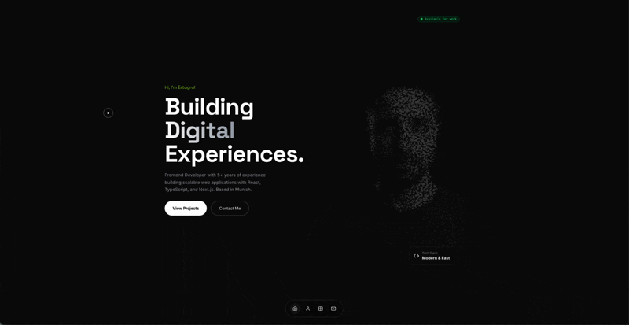

# ertudev.app

My personal portfolio — built with Next.js 16 and React 19. Features interactive particle effects, smooth animations, and a dark theme.

🔗 **Live:** [ertudev.app](https://www.ertudev.app)



## Tech Stack

- Next.js 16 (App Router)
- React 19
- TypeScript
- Tailwind CSS 4
- Three.js + WebGL (particle effects)
- GSAP (animations)
- Tone.js (subtle audio feedback)

## Features

- Interactive particle system that reacts to mouse/touch
- Multi-page layout with smooth transitions
- Bento grid design on About page
- Custom cursor (desktop only)
- Fully responsive
- SEO optimized with proper meta tags

## Getting Started

```bash
npm install
npm run dev
```

Open [localhost:3000](http://localhost:3000) to see it.

## Project Structure

```
app/
├── page.tsx          # Home with hero + particles
├── about/            # About me with bento grid
├── projects/         # Portfolio items
└── contact/          # Contact form
components/
├── InteractiveParticles/  # Three.js particle system
├── CustomCursor.tsx
└── Navigation.tsx
```

## Deployment

Deployed on Vercel with custom domain. Just push to main and it auto-deploys.

---

Built by [Ertugrul Hasanbeyoglu](https://github.com/Hasanbeyoglu) • Munich, Germany
